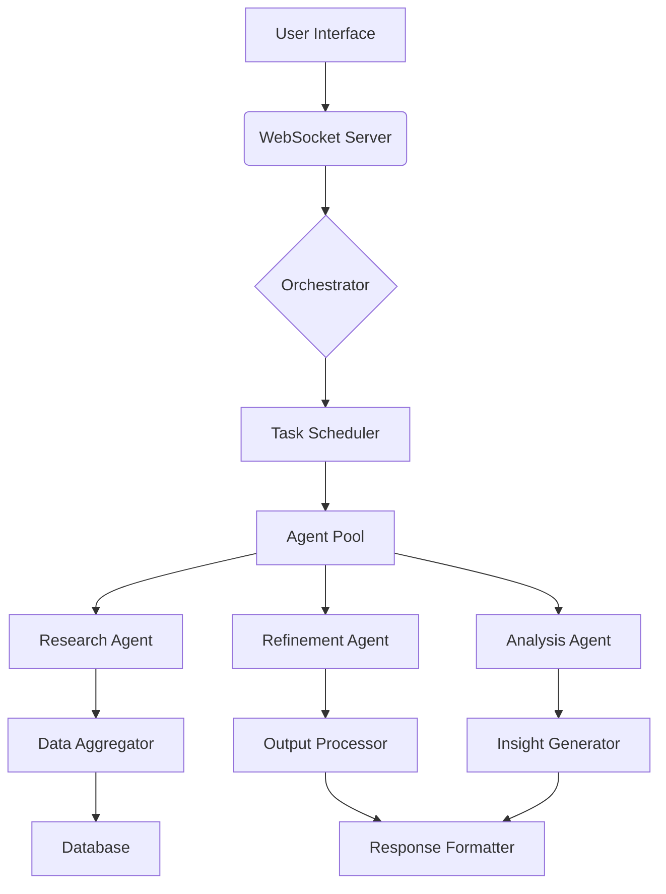
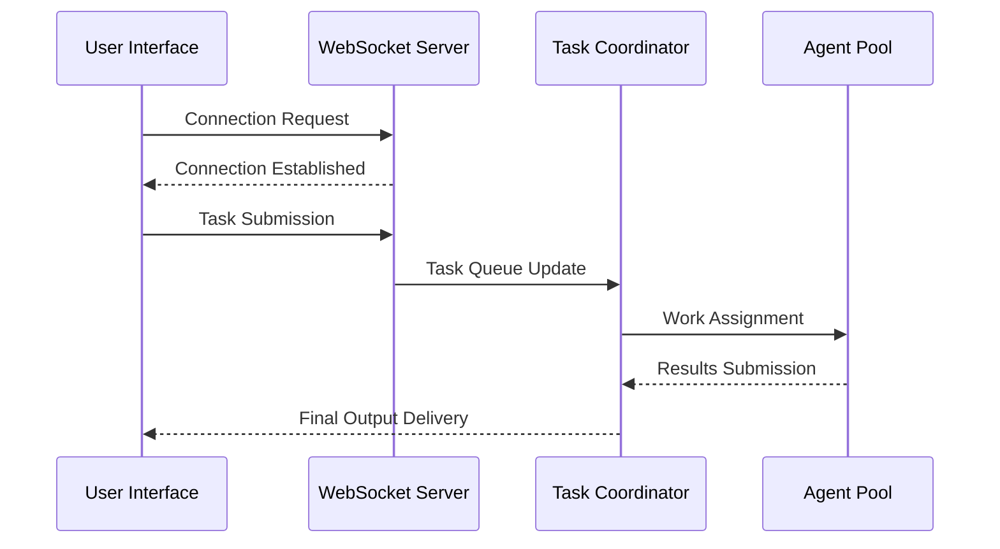

# High-Level Design Document (HLD)

## 🏗️ Architectural Overview
The system employs a modular architecture with three core layers:
1. **Agent Layer** - Composed of specialized AI agents handling task-specific operations
2. **Orchestrator Layer** - Manages workflow coordination via CrewAI framework
3. **Service Layer** - Provides external API integrations and data processing

## 🧩 Component Breakdown

## 📡 System Integration Flows

## 🧠 User Interaction Pathways
1. **Input Phase**: Users submit tasks through the web interface (app/static/index.html)
2. **Processing**:
   - WebSocket server routes requests to orchestrator
   - Orchestrator assigns tasks to appropriate agents
   - Agents perform research, analysis, and refinement operations
3. **Output**: Formatted results delivered via WebSocket to client application

## 🧪 Technical Constraints
- Must maintain compatibility with LMStudio API for model execution
- Requires persistent database connection for intermediate storage
- Limited to 10 concurrent agent operations per request

## 🚀 Scalability Considerations
- Horizontal scaling of agent nodes for increased workload
- Caching mechanism for frequently accessed research data
- Asynchronous processing queue for task management

## ✅ Decision Rationale
1. **CrewAI Framework**: Chosen for its flexible agent orchestration capabilities
2. **WebSocket Integration**: Enables real-time interaction without page reloads
3. **Modular Architecture**: Facilitates easier maintenance and extension
4. **Mermaid Diagrams**: Provides clear visual representation of complex systems

## 🔍 Gap Analysis Findings
### 1. Database Integration Gap
- *Issue*: No database models or ORM configurations found in `app/models/` directory
- *Impact*: Violates HLD requirement for persistent storage (line 54)
- *Recommendation*: 
  - Create SQLAlchemy models in `app/models/database.py`
  - Implement connection pooling in `app/services/lmstudio.py`
  - Add migration scripts in `project_journal/`

### 2. Concurrency Control Gap
- *Issue*: No explicit concurrency limit enforcement in `app/orchestrator/crew.py` (line 55)
- *Impact*: Could lead to resource exhaustion under load
- *Recommendation*: 
  - Implement rate limiting using Redis in `app/services/lmstudio.py`
  - Add semaphore pooling in `app/orchestrator/crew.py`

### 3. Caching Mechanism Gap
- *Issue*: No caching layer implementation (line 59)
- *Impact*: Misses opportunity for performance optimization
- *Recommendation*: 
  - Integrate Redis with `app/services/research.py`
  - Add cache decorators to agent methods in `app/agents/`

### 4. Asynchronous Processing Gap
- *Issue*: No explicit message queue implementation (line 60)
- *Impact*: Limits scalability potential
- *Recommendation*: 
  - Implement RabbitMQ integration in `app/services/lmstudio.py`
  - Create task queue manager in `app/orchestrator/crew.py`

### 5. Error Handling Gap
- *Issue*: Minimal WebSocket error handling in `app/main.py` (line 48)
- *Impact*: Could lead to unstable real-time connections
- *Recommendation*: 
  - Add comprehensive error logging in `app/main.py`
  - Implement reconnect logic for WebSocket in `app/websocket.py`