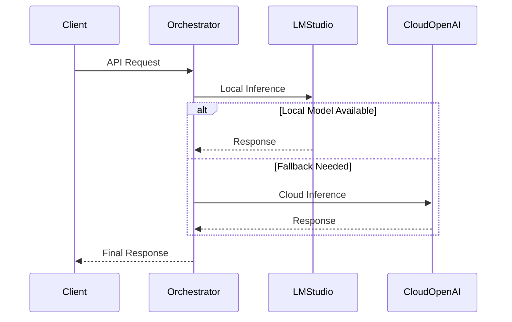

# Integrating LM Studio with OpenAI-Compatible Systems

## Overview of LM Studio's OpenAI-Compatible API

LM Studio provides a local LLM server that supports OpenAI-compatible API endpoints, enabling developers to leverage existing OpenAI client libraries while running models locally. This compatibility allows seamless integration with applications originally designed for OpenAI's cloud services[5][8][12].

### Key API Endpoints
The LM Studio server exposes four main OpenAI-style endpoints:
- `GET /v1/models`: List available models
- `POST /v1/chat/completions`: Chat completions endpoint
- `POST /v1/embeddings`: Text embeddings generation
- `POST /v1/completions`: Legacy completions endpoint[5][12]

```python
from openai import OpenAI

client = OpenAI(
    base_url="http://localhost:1234/v1",
    api_key="lm-studio"  # Placeholder required by client
)

response = client.chat.completions.create(
    model="local-model",  # Model identifier from LM Studio
    messages=[{"role": "user", "content": "Explain quantum computing"}]
)
```

## Implementation Strategy for LM Studio Integration

### 1. Environment Configuration
Configure the OpenAI client to point to LM Studio's local server:

```python
# Recommended configuration pattern
import os
from openai import OpenAI

def get_client():
    return OpenAI(
        base_url=os.getenv("LMSTUDIO_BASE_URL", "http://localhost:1234/v1"),
        api_key=os.getenv("LMSTUDIO_API_KEY", "lm-studio")
    )
```

### 2. Model Management
Use LM Studio's CLI (`lms`) for model operations[2][9]:
```bash
# List available models
lms ls

# Load a model with GPU offloading
lms load TheBloke/Mistral-7B-Instruct-v0.1-GGUF --gpu=0.5

# Verify loaded models
lms ps
```

### 3. API Request Handling
Handle differences between cloud and local implementations:

```python
def generate_text(prompt, max_tokens=200):
    client = get_client()
    try:
        response = client.chat.completions.create(
            model="local-model",
            messages=[{"role": "user", "content": prompt}],
            temperature=0.7,
            max_tokens=max_tokens
        )
        return response.choices[0].message.content
    except APIError as e:
        handle_error(e)
```

## Architectural Considerations

### Service Discovery Pattern


### Hybrid Deployment Configuration
```python
class InferenceRouter:
    def __init__(self):
        self.local_client = OpenAI(
            base_url="http://localhost:1234/v1",
            api_key="lm-studio"
        )
        self.cloud_client = OpenAI(
            api_key=os.getenv("OPENAI_API_KEY")
        )

    def route_request(self, prompt):
        try:
            return self.local_client.chat.completions.create(
                model="local-model",
                messages=[{"role": "user", "content": prompt}]
            )
        except APIError:
            return self.cloud_client.chat.completions.create(
                model="gpt-4",
                messages=[{"role": "user", "content": prompt}]
            )
```

## Performance Optimization

### Batch Processing Implementation
```python
def batch_process(prompts, batch_size=4):
    client = get_client()
    results = []
    
    with ThreadPoolExecutor(max_workers=batch_size) as executor:
        futures = [
            executor.submit(
                client.chat.completions.create,
                model="local-model",
                messages=[{"role": "user", "content": prompt}]
            ) for prompt in prompts
        ]
        
        for future in as_completed(futures):
            results.append(future.result())
    
    return results
```

### Caching Mechanism
```python
from functools import lru_cache

@lru_cache(maxsize=1000)
def cached_generation(prompt_hash):
    client = get_client()
    response = client.chat.completions.create(
        model="local-model",
        messages=[{"role": "user", "content": prompt_hash}]
    )
    return response.choices[0].message.content
```

## Monitoring and Diagnostics

### Logging Configuration
```python
import logging
from lmstudio import log_stream

logging.basicConfig(
    level=logging.INFO,
    format="%(asctime)s - %(levelname)s - %(message)s"
)

def monitor_requests():
    for log_entry in log_stream():
        logging.info(
            f"Model: {log_entry.modelIdentifier} | "
            f"Tokens: {log_entry.tokenCount} | "
            f"Duration: {log_entry.durationMs}ms"
        )
```

### Performance Metrics
```python
class PerformanceMonitor:
    def __init__(self):
        self.metrics = {
            "total_requests": 0,
            "successful_requests": 0,
            "average_latency": 0
        }

    def update_metrics(self, start_time, success=True):
        latency = time.time() - start_time
        self.metrics["total_requests"] += 1
        if success:
            self.metrics["successful_requests"] += 1
        self.metrics["average_latency"] = (
            self.metrics["average_latency"] * 
            (self.metrics["total_requests"] - 1) + latency
        ) / self.metrics["total_requests"]
```

## Security Considerations

### Authentication Layer
```python
from fastapi import Security, HTTPException
from fastapi.security import APIKeyHeader

api_key_header = APIKeyHeader(name="X-API-KEY")

async def get_api_key(api_key: str = Security(api_key_header)):
    if api_key != os.getenv("API_SECRET"):
        raise HTTPException(
            status_code=401,
            detail="Invalid API Key"
        )
    return api_key
```

### Request Validation
```python
from pydantic import BaseModel, constr

class GenerationRequest(BaseModel):
    prompt: constr(max_length=1000)
    max_tokens: int = Field(gt=0, le=1000)
    temperature: float = Field(ge=0.0, le=2.0)

@app.post("/generate")
async def generate_text(
    request: GenerationRequest,
    api_key: str = Depends(get_api_key)
):
    return generate_text(request.prompt)
```

## Model Management

### Dynamic Model Loading
```python
import subprocess

def load_model(model_id, gpu_allocation=0.5):
    try:
        subprocess.run([
            "lms", "load", model_id,
            "--gpu", str(gpu_allocation),
            "--context-length", "4096"
        ], check=True)
        return True
    except subprocess.CalledProcessError:
        return False
```

### Model Versioning
```python
MODEL_REGISTRY = {
    "default": "TheBloke/Mistral-7B-Instruct-v0.1-GGUF",
    "legacy": "TheBloke/Llama-2-7B-Chat-GGUF",
    "experimental": "TheBloke/Mixtral-8x7B-Instruct-v0.1-GGUF"
}

def get_model_version(version):
    return MODEL_REGISTRY.get(version, MODEL_REGISTRY["default"])
```

## Error Handling and Recovery

### Retry Mechanism
```python
from tenacity import retry, stop_after_attempt, wait_exponential

@retry(
    stop=stop_after_attempt(3),
    wait=wait_exponential(multiplier=1, min=2, max=10)
)
def reliable_generation(prompt):
    client = get_client()
    return client.chat.completions.create(
        model="local-model",
        messages=[{"role": "user", "content": prompt}]
    )
```

### Fallback Strategy
```python
def resilient_generation(prompt):
    try:
        return local_generation(prompt)
    except APIError as e:
        logging.warning(f"Local inference failed: {str(e)}")
        return cloud_generation(prompt)

def local_generation(prompt):
    client = get_client()
    return client.chat.completions.create(...)

def cloud_generation(prompt):
    cloud_client = OpenAI(api_key=os.getenv("OPENAI_API_KEY"))
    return cloud_client.chat.completions.create(...)
```

## Conclusion

This integration pattern enables seamless use of LM Studio's local inference capabilities while maintaining compatibility with OpenAI's API specifications. The architecture supports hybrid deployments, allowing fallback to cloud services when local resources are insufficient. The implementation includes robust error handling, performance monitoring, and security features essential for production-grade systems.

Citations:
[1] [LM Studio REST API (beta)](https://lmstudio.ai/docs/api/rest-api)  
[2] [Introducing lms: LM Studio's CLI](https://lmstudio.ai/blog/lms)  
[3] [The Complete Guide for Using the OpenAI Python API - New Horizons](https://www.newhorizons.com/resources/blog/the-complete-guide-for-using-the-openai-python-api)  
[4] [Azure ai openai with crewai - Restack](https://www.restack.io/p/crewai-answer-azure-ai-openai-cat-ai)  
[5] [OpenAI Compatibility API | LM Studio Docs](https://lmstudio.ai/docs/api/openai-api)  
[6] [Support on setting the API_BASE variable · Issue #1051 - GitHub](https://github.com/openai/openai-python/issues/1051)  
[7] [How to change OpenAI's baseURL · Issue #91 · wandb/openui](https://github.com/wandb/openui/issues/91)  
[8] [LM Studio as a Local LLM API Server](https://lmstudio.ai/docs/local-server)  
[9] [Introducing lms: LM Studio's CLI](https://lmstudio.ai/blog/lms)  
[10] [OpenAI python module: using Azure and OpenAI at the same time](https://community.openai.com/t/openai-python-module-using-azure-and-openai-at-the-same-time/144012)  
[11] [Parameters to send while creating openai object in python - API](https://community.openai.com/t/parameters-to-send-while-creating-openai-object-in-python/836775)  
[12] [OpenAI Compatibility API | LM Studio Docs](https://lmstudio.ai/docs/api/openai-api)  
[13] [The official Python library for the OpenAI API - GitHub](https://github.com/openai/openai-python)  
[14] [Why is there no API integration for LM Studio? : r/SillyTavernAI - Reddit](https://www.reddit.com/r/SillyTavernAI/comments/1atr53h/why_is_there_no_api_integration_for_lm_studio/)  
[15] [API Reference - OpenAI API](https://platform.openai.com/docs/api-reference?lang=python)  
[16] [joryleech/Godot-LM-Studio-Api-Integration - GitHub](https://github.com/joryleech/Godot-LM-Studio-Api-Integration/)  
[17] [Openai-Python Api Base Url | Restackio](https://www.restack.io/p/openai-python-answer-api-base-url-cat-ai)  
[18] [How to migrate to OpenAI Python v1.x - Azure - Learn Microsoft](https://learn.microsoft.com/en-us/azure/ai-services/openai/how-to/migration)  
[19] [Tool Use | LM Studio Docs](https://lmstudio.ai/docs/advanced/tool-use)  
[20] [lms — LM Studio's CLI | LM Studio Docs](https://lmstudio.ai/docs/cli)  
[21] [API Reference - OpenAI API](https://platform.openai.com/docs/api-reference/introduction)  
[22] [Hello World needing OpenAI API · Issue #324 · crewAIInc/crewAI](https://github.com/joaomdmoura/crewAI/issues/324)  
[23] [How to Easily Share LM studio API Online - Pinggy](https://pinggy.io/blog/lm_studio/)  
[24] [Install and Run LM Studio CLI Locally - LMS - YouTube](https://www.youtube.com/watch?v=k6Ve3e0S91o)  
[25] [Python example app from the OpenAI API quickstart tutorial - GitHub](https://github.com/openai/openai-quickstart-python)  
[26] [Configuring Azure OpenAI with CrewAI: A Comprehensive Guide](https://blog.crewai.com/configuring-azure-openai-with-crewai-a-comprehensive-guide/)  
[27] [About LM Studio | LM Studio Docs](https://lmstudio.ai/docs)  
[28] [LM Studio CLI: Speed Up Your AI App Development (100% Local + UI)](https://www.youtube.com/watch?v=QL9CfGffk6Q)  
[29] [Developer quickstart - OpenAI API](https://platform.openai.com/docs/quickstart)  
[30] [Building an Agentic AI Application Using CrewAI and Azure OpenAI](https://www.linkedin.com/pulse/building-agentic-ai-application-using-crewai-ranjeeta-kumari-rypoc)  
[31] [OpenAI Python Library - PyPI](https://pypi.org/project/openai/0.26.3/)  
[32] [base_url of OpenAI Client Instance Cannot Be Modified Due to ...](https://github.com/openai/openai-python/issues/913)  
[33] [openai 0.28.1 - PyPI](https://pypi.org/project/openai/0.28.1/)  
[34] [Add API_BASE_URL Option for OpenAI Integration to Support ...](https://community.home-assistant.io/t/add-api-base-url-option-for-openai-integration-to-support-multiple-endpoints/737818)  
[35] [OpenAI-Compatible Endpoints - LiteLLM](https://docs.litellm.ai/docs/providers/openai_compatible)  
[36] [Lesson 4: what is the OpenAI-BaseURL? - DeepLearning.AI](https://community.deeplearning.ai/t/lesson-4-what-is-the-openai-baseurl/581056)  
[37] [Deploy a model and generate text using the legacy completions API ...](https://learn.microsoft.com/en-us/azure/ai-services/openai/quickstart)  
[38] [OpenAI Compatibility API | LM Studio Docs](https://lmstudio.ai/docs/api/openai-api)  
[39] [OpenAI compatibility | Gemini API | Google AI for Developers](https://ai.google.dev/gemini-api/docs/openai)  
[40] [Configuring the SDK - OpenAI Agents SDK](https://openai.github.io/openai-agents-python/config/)