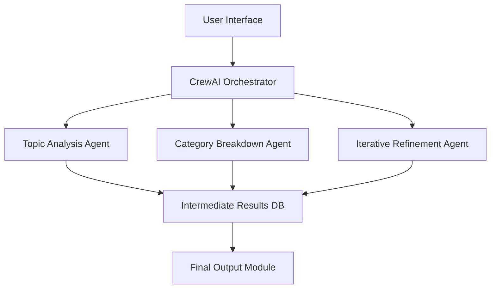

# Orchestration Layer Implementation Plan (Epic 1 - Ticket 2)

## 📌 Overview
Implement a dynamic agent orchestration system using CrewAI that coordinates specialized agents through configurable workflows while maintaining robust error handling and validation.

## 🧭 Architecture Design
1. **Core Components**
   - Agent registry with role-based permissions
   - Workflow engine with YAML configuration support
   - Centralized task queue with priority levels
   - Monitoring dashboard for agent performance

2. **Data Flow**

## 🛠️ Implementation Steps
### Phase 1: Setup (2 days)
- Install CrewAI SDK and dependencies
- Configure virtual environment with Python 3.10+
- Set up logging and monitoring infrastructure

### Phase 2: Core Functionality (5 days)
- Implement agent registration system
- Develop base workflow engine with:
  - Task prioritization logic
  - Agent load balancing
  - Automatic failover mechanisms

### Phase 3: Dynamic Workflows (3 days)
- Create YAML configuration schema for workflows
- Implement dynamic workflow loader
- Add API endpoints for runtime configuration changes

### Phase 4: Integration (3 days)
- Connect with existing agents in `src/orchestrator/agents/`
- Implement data validation layers using Pydantic
- Set up communication protocols with message queues

## 🧪 Testing Strategy
1. **Unit Tests**
   - 100% coverage for core orchestration logic
   - Mock agent implementations for testing

2. **Integration Tests**
   - Simulated multi-agent processing chains
   - Stress tests with 1000+ concurrent tasks
   - Edge case testing for error conditions

3. **Performance Benchmarks**
   - Latency measurements under load
   - Throughput testing with varying task complexity

## 📦 Dependencies
- CrewAI SDK (v2.4+)
- Python 3.10+
- Redis for message queuing
- Pydantic v1.9+
- pytest for testing framework

## 📄 Documentation
1. API Reference Guide (Swagger format)
2. Deployment guide with:
   - Containerization instructions
   - Scaling recommendations
   - Monitoring setup

3. Usage examples in `docs/System_Architecture.md`

## 🗓️ Timeline
| Phase | Estimated Duration |
|-------|---------------------|
| Setup | 2 days |
| Core Functionality | 5 days |
| Dynamic Workflows | 3 days |
| Integration | 3 days |
| Testing | 3 days |